# 1. Basic HDL Code Generation Workflow
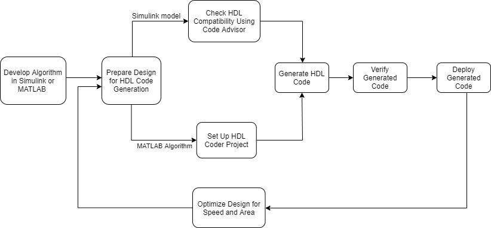

# 2. Simulink Model

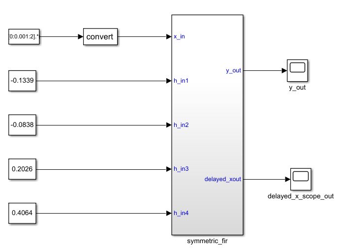

- The **symmetric_fir** subsystem, which implements the filter algorithm, is the device under test (DUT). An HDL entity is generated from this subsystem.
- The **top-level model components** that drive the subsystem work as a test bench.

The top-level model generates 16-bit fixed-point input signals for the symmetric_fir subsystem. The Signal From Workspace block generates a test input (stimulus) signal for the filter. The four Constant blocks provide filter coefficients. The Scope blocks are used for simulation and are not used for HDL code generation.

* * * 

# 3. Check HDL Compatibility
Before generating HDL code, you can check and update the model for HDL compatibility by using the HDL Code Advisor. 

The HDL Code Advisor verifies and updates your Simulink® model or subsystem for compatibility with HDL code generation. The Model Checker checks for model configuration settings, ports and subsystem settings, block settings, support for native floating point, and conformance to the industry-standard rules. The Code Advisor produces a report that lists suboptimal conditions or settings, and then proposes better model configuration settings.

## 3.1 Run Checks In the HDL Code Advisor
In the HDL Code Advisor window, you can run individual checks or a group of checks. To run a check, Select that check and then click Run This Check. For example, to run the Check for safe model parameters, select the check box, and then click Run This Check.

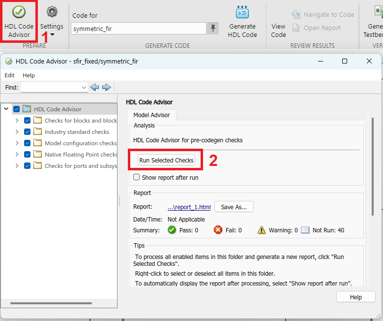

## 3.2 Fix HDL Code Advisor Warnings or Failures

In the HDL Code Advisor, if a check fails, the right pane shows the warning or failure information in a Result subpane. The Result subpane displays model settings that are not compliant. For some tasks, use the Action subpane to apply the Code Advisor recommended settings. This example displays the incorrect model settings that caused the Check for safe model parameters to fail.

:pushpin: To apply the corresponding model configuration settings that the code generator reported in the Result subpane, click the Modify Settings button. After you click Modify Settings, the Result subpane reports the changes that were applied. You can now run this check.

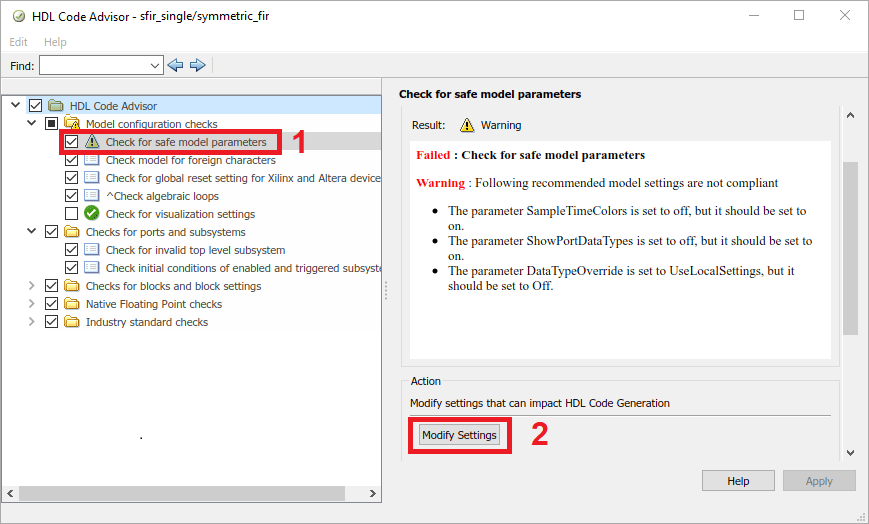

## 3.3 View and Save HDL Code Advisor Reports
When you run checks in the HDL Code Advisor, HDL Coder™ generates an HTML report of the check results. Each folder in the HDL Code Advisor contains a report for the checks within that folder and its subfolders.

To access reports, select a folder such as Model configuration checks, and in the Report subpane, click Save As.

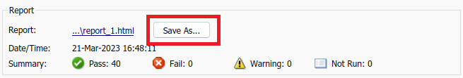

If you rerun the HDL Code Advisor, the report is updated in the working folder, not in the save location.
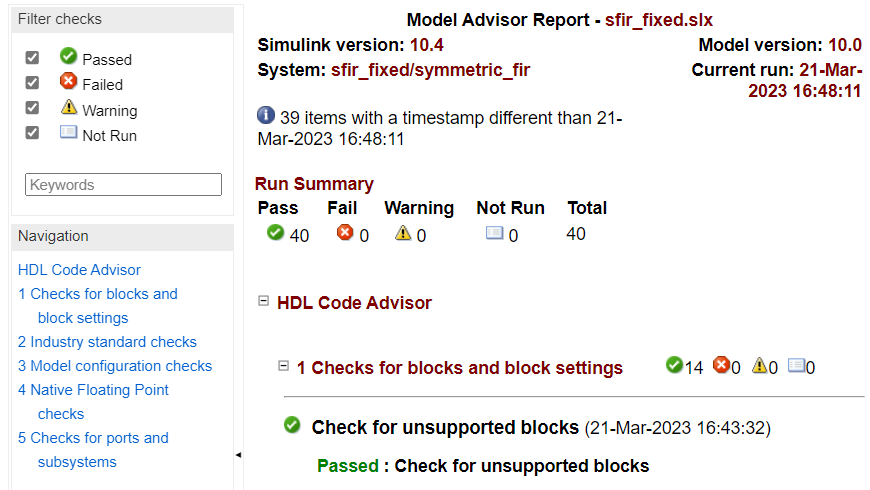

# 4. Generate Verilog Code 
To generate Verilog code for the counter model:
1. In the HDL Code tab, click Settings.
2. In the HDL Code Generation pane, for Language, select Verilog. Click Apply and then click Generate.

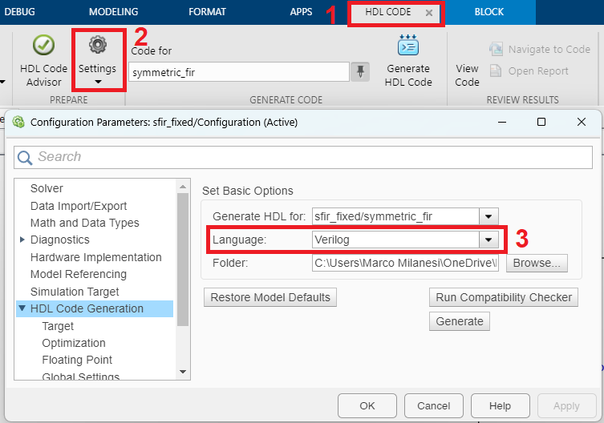

The process is completed and displays the message

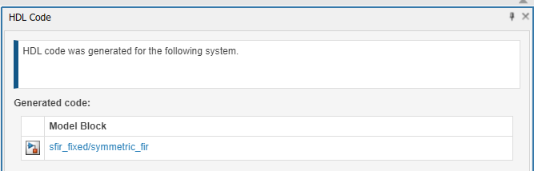

## 4.1 View HDL Code Generation Files
 To view the generated code and script files double-click the folder that has the same name as the model for which you generated HDL code.
 
 - `symmetric_fir.v`
 - `symmetric_fir_report.html` HDL check report displays HDL code generation status and warnings or messages
 - `gm_sfir_fixed.slx` Generated model that behaviorally represents the HDL code in the Simulink modeling environment.

To view your generated HDL code alongside your model, you can use the Code view and then you double click on the model block you want to open 

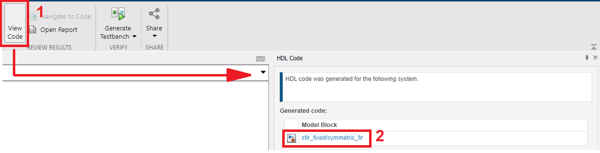

## 4.2 Inspect Generated HDL Code
To identify the mapping between the source model and the generated HDL code more easily, generate a traceability report. Use the report to navigate from a block in your model to the generated code for that block and from the code to a block in your model.

To generate the traceability report:
1. In the HDL Code tab, click Settings > Report Options.
2. In the HDL Code Generation > Report pane, select Generate traceability report, and then generate HDL code for the HDL_DUT subsystem

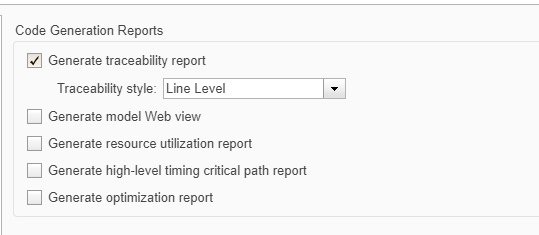

To navigate from model elements to their generated code, in your model, click a block. The Code view highlights the code for the block and scrolls to the highlighted code lines.

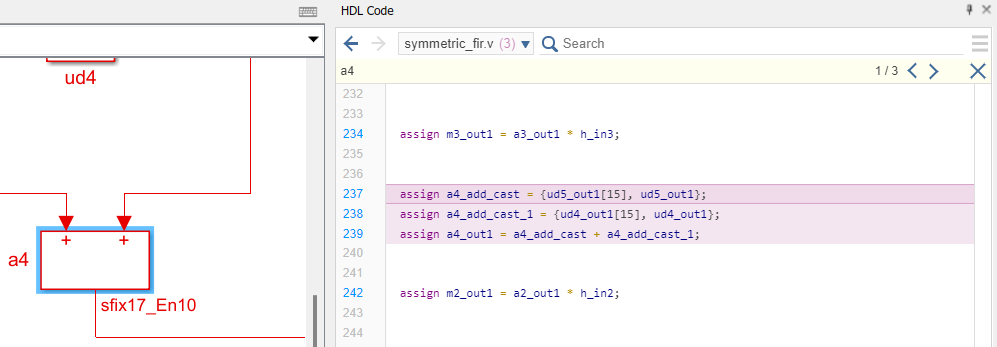

## 4.3 Validate HDL Behavior Using Validation Model
To validate the behavioral model of the HDL code with your original model, generate a validation model. The validation model contains both the original model and generated model. It compares the outputs of both models by using the test vectors that you provided in the original model.

To generate the validation model:
1. In the HDL Code tab, click Settings.
2. In the HDL Code Generation > Global Settings > Model Generation tab, select Validation model, and then generate HDL code for the HDL_DUT subsystem.

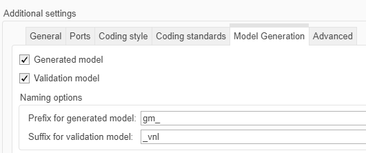

After you simulate the model, double-click the Compare subsystem, and then navigate inside the Assert_Out subsystem. If you open the Scope block, you see that the err signal has a value of zero, which means that the generated model output matches the original model.

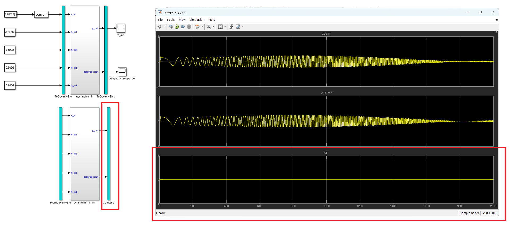

* * *
# 5. Verify Generated HDL Code
To verify the functionality of the HDL code for the DUT, generate a HDL test bench. A test bench includes:

- Stimulus data generated by signal sources connected to the entity under test.
- Output data generated by the entity under test. During a test bench run, this data is compared to the outputs of the VHDL® model for verification.
- Clock, reset, and clock enable inputs to drive the entity under test.
- A component instantiation of the entity under test.
- Code to drive the entity under test and compare its outputs to the expected data.

You can simulate the generated test bench and script files by using the Mentor Graphics® ModelSim® simulator.

To generate Verilog testbench code for the counter model:

1. In the HDL Code tab, click Settings.
2. In the HDL Code Generation pane, for Language, select Verilog.
3. In the HDL Code Generation > Test Bench pane, click Generate Test Bench.

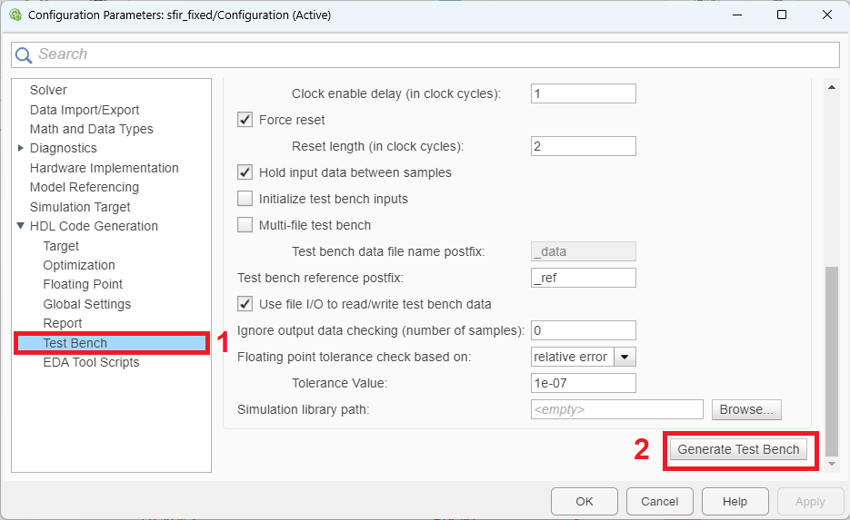

